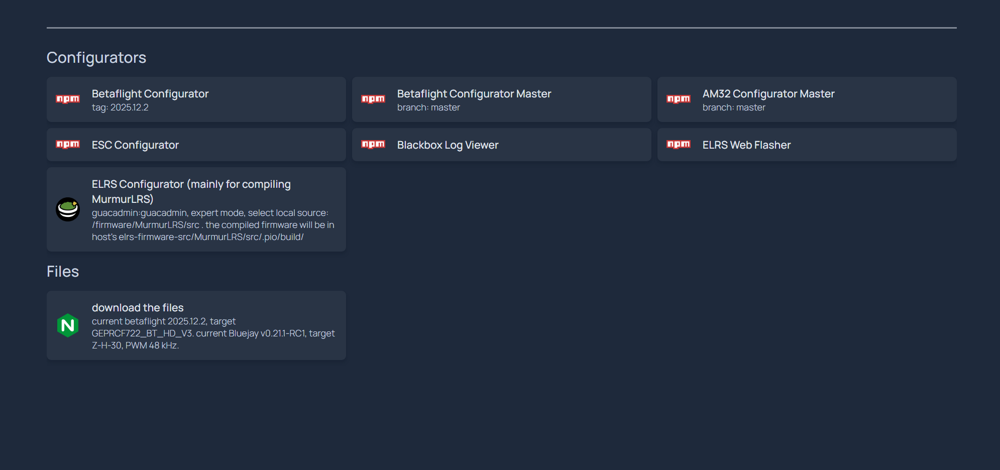

## what the stack does

- clones Betaflight firmware repo and compiles the firmware for the target set in `.env`
- downloads Bluejay firmware HEXes for the target and PWM set in `.env`
- clones the reps of ELRS web flasher (and downloads all the artifacts), ESC Configurator, Betaflight Configurator, the Blackbox viewer and AM32 Configurator, builds them at container image build stage. Everything is downloaded and baked into the images so the consequent startups are fast.
- starts the `homepage` container for a convenient [starting page](http://localhost:81)
  <br>

## video on Youtube

[](https://www.youtube.com/watch?v=1Zfap0P8PoI "Flashing Betaflight offline")

## the host

Ubuntu VM with docker. or baremetal windows with docker. here are the [instructions how to install docker on debian](https://github.com/placebeyondtheclouds/gpu-home-server?tab=readme-ov-file#continue-setting-up-the-debian-lxc-with-gpu-enabled-docker). for ubuntu just replace `debian` with `ubuntu` in one command

## do it once

`git clone https://github.com/placebeyondtheclouds/fpv-offline.git && cd fpv-offline && chmod 777 fw`

## setup envs

check for new versions at:

```
https://github.com/betaflight/betaflight
https://github.com/betaflight/blackbox-log-viewer
https://github.com/betaflight/betaflight-configurator
https://github.com/bird-sanctuary/bluejay
https://github.com/stylesuxx/esc-configurator
https://github.com/am32-firmware/am32-configurator
```

rename `sample.env` to `.env`, setup targets and versions in the variables in `.env`. use proxy, can be blank.

a quote from `./src/main/target/common_pre.h` on [extra flags](https://www.betaflight.com/docs/development/API/Cloud-Build-API):

```
    CLOUD_BUILD is used to signify that the build is a user requested build and that the
    features to be enabled will be defined ALREADY.

    CORE_BUILD is used to signify that the build is a user requested build and that the
    features to be enabled will be the minimal set, and all the drivers should be present.

    If neither of the above are present then the build should simply be a baseline build
    for continuous integration, i.e. the compilation of the majority of features and drivers
    dependent on the size of the flash available.

```

## disable calling home

```
sudo tee -a /etc/hosts <<-'EOF'
127.0.0.1 img.shields.io
127.0.0.1 build.betaflight.com
127.0.0.1 analytics.betaflight.com
127.0.0.1 betaflight.com
127.0.0.1 googletagmanager.com
EOF
```

for windows, it's in `C:\Windows\System32\drivers\etc`

## start everything

```shell
docker compose up
```

navigate to **http://localhost:81** in Chrome browser

the firmware files are in `./fw` and are served as an open directory (**be aware**) at http://localhost:86

Betaflight Configurator is available in two builds:

- tagged version from `.env`: http://localhost:82
- `master` branch build: http://localhost:88

AM32 Configurator `master` branch build is available at http://localhost:89

## update Betaflight or Bluejay firmware targets and options

just edit `.env` and restart the stack. set BETAFLIGHT_BRANCH to `master` (and ignore the version) to build the latest version of the firmware

## update the configurators and the Blackbox viewer versions

`docker compose down -v` to delete all volumes and `docker compose up --build --force-recreate configurator-betaflight configurator-betaflight-master configurator-am32-master configurator-esc bb`

## cleanup

```
docker compose up --remove-orphans
docker builder prune --force
docker system prune --force
```

## remote access

on the local machine:

`ssh -N -L 81:localhost:81 -L 82:localhost:82 -L 83:localhost:83 -L 84:localhost:84 -L 85:localhost:85 -L 86:localhost:86 -L 88:localhost:88 -L 89:localhost:89 192.168.100.175` where 192.168.100.175 is the machine where this stack is running

## todo

- [x] make elrs configurator work

## ref

- https://github.com/nvm-sh/nvm
- https://www.betaflight.com/docs/development
